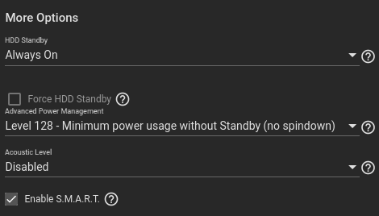
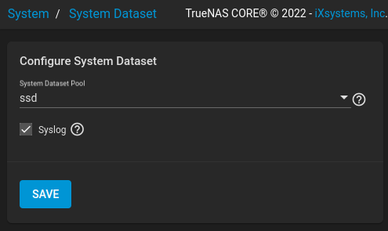
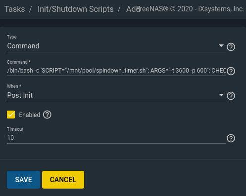

# TrueNAS Spindown Timer

_Monitors drive I/O and forces HDD spindown after a given idle period. Resistant
to S.M.A.R.T. reads._

Disk spindown has always been an issue for various TrueNAS / FreeNAS users. This
script utilizes `iostat` to detect I/O operations (reads, writes) on each disk.
If a disk was neither read nor written for a given period of time, it is
considered idle and is spun down.

Periodic reads of S.M.A.R.T. data performed by the smartctl service are excluded.
This allows users to have S.M.A.R.T. reporting enabled while being able to
automatically spin down disks. The script moreover is immune to the periodic
disk temperature reads in newer versions of TrueNAS.

Successfully tested on (most relevant):
  * **`TrueNAS-13.0-U3.1 (Core)`**
  * **`TrueNAS SCALE 22.12.0`**
  * `TrueNAS-12.0 (Core)`
  * `FreeNAS-11.3`

A full list of all tested TrueNAS / FreeNAS versions can be found at the end of
this file.


## Key Features

  * [Periodic S.M.A.R.T. reads do not interfere with spindown](#configure-disk-standby-settings)
  * [Support for ATA and SCSI devices](#verify-drive-spindown--optional-)
  * [Works with both TrueNAS Core and TrueNAS SCALE](#tested-truenas--freenas-versions)
  * [Can operate on single disks or whole ZFS pools](#operation-mode--disk-vs-zpool)
  * [Per-disk idle timer / Independent spindown](#operation-mode--disk-vs-zpool)
  * [Configurable idle timeout and poll interval](#using-separate-timeouts-for-different-drives)
  * [Different idle timeouts for different disks / ZFS pools](#using-separate-timeouts-for-different-drives)
  * [Automatic detection or explicit listing of drives / ZFS pools to monitor](#usage)
  * [Ignoring of specific drives / ZFS pools (e.g. SSD with system dataset)](#usage)
  * [Executable via `Tasks` as `Post-Init Script`, configurable via TrueNAS GUI](#automatic-start-at-boot)
  * [Allows script placement on encrypted pool](#delayed-start--script-placed-in-encrypted-pool-)
  * [Optional automatic shutdown after configurable idle time](#automatic-system-shutdown--s-timeout)


## Usage

```
Usage:
  spindown_timer.sh [-h] [-q] [-v] [-d] [-m] [-u <MODE>] [-t <TIMEOUT>] [-p <POLL_TIME>] [-i <DRIVE>] [-s <TIMEOUT>]

Monitors drive I/O and forces HDD spindown after a given idle period.
Resistant to S.M.A.R.T. reads.

Operation is supported on either drive level (MODE = disk) with plain device
identifiers or zpool level (MODE = zpool) with zfs pool names. See -u for more
information. A drive is considered idle and gets spun down if there has been no
I/O operations on it for at least TIMEOUT seconds. I/O requests are detected
within multiple intervals with a length of POLL_TIME seconds. Detected reads or
writes reset the drives timer back to TIMEOUT.

Options:
  -t TIMEOUT   : Total spindown delay. Number of seconds a drive has to
                 experience no I/O activity before it is spun down (default: 3600).
  -p POLL_TIME : I/O poll interval. Number of seconds to wait for I/O during a
                 single monitoring period (default: 600).
  -s TIMEOUT   : Shutdown timeout. If given and no drive is active for TIMEOUT
                 seconds, the system will be shut down.
  -u MODE      : Operation mode (default: disk).
                 If set to 'disk', the script operates with disk identifiers
                 (e.g. ada0) for all CLI arguments and monitors I/O using
                 iostat directly.
                 If set to 'zpool' the script operates with ZFS pool names
                 (e.g. zfsdata) for all CLI arguments and monitors I/O using
                 the iostat of zpool.
  -i DRIVE     : In automatic drive detection mode (default):
                   Ignores the given drive or zfs pool.
                 In manual mode [-m]:
                   Only monitor the specified drives or zfs pools. Multiple
                   drives or zfs pools can be given by repeating the -i option.
  -m           : Manual drive detection mode. If set, automatic drive detection
                 is disabled.
                 CAUTION: This inverts the -i option, which can then be used to
                 manually supply drives or zfs pools to monitor. All other drives
                 or zfs pools will be ignored.
  -q           : Quiet mode. Outputs are suppressed set.
  -v           : Verbose mode. Prints additional information during execution.
  -d           : Dry run. No actual spindown is performed.
  -h           : Print this help message.

Example usage:
spindown_timer.sh
spindown_timer.sh -q -t 3600 -p 600 -i ada0 -i ada1
spindown_timer.sh -q -m -i ada6 -i ada7 -i da0
spindown_timer.sh -u zpool -i freenas-boot

```

## Deployment and configuration

The following steps describe how to configure TrueNAS and deploy the script.


### Configure disk standby settings

To prevent the smartctl daemon or TrueNAS from interfering with spun down disks,
open the TrueNAS GUI and navigate to `Storage > Disks`.

For every disk you want to spin down, click the `Edit` button. Set the `HDD
Standby` option to `Always On` and `Advanced Power Management` to level 128 or
above. 



_Note: In older versions of FreeNAS it was required to set the S.M.A.R.T `Power
Mode` to `Standby`. This setting was configured globally and was located under
`Services > S.M.A.R.T. > Configure`._


### System dataset placement

Having the TrueNAS system dataset placed on a drive / ZFS pool prevents spindown.
The system dataset should therefore be located on a disk that will not be spun
down (e.g. the operating system SSD).

The location of the system dataset can be configured under `System > System
Dataset`.




### Deploy script

Copy the script to your NAS box and set the execution permission through `chmod
+x spindown_timer.sh`.

That's it! The script can now be run, e.g., in a `tmux` session. However, an
automatic start during boot is highly recommended (see next section).


### Operation Mode: disk vs zpool

The spindown timer support two operation modes, as selected by the `-u <MODE>`
CLI argument (default: `disk`):

- `disk`: Operates with plain disk identifiers (e.g. `ada0`, `sda`, ...). Each
  disk is monitored and spun down independently. Disks can even be spun down if
  they are not part of any ZFS pool (e.g. for hot standby). The CLI option `-i`
  will expect disk names as found in `/dev`.
- `zpool`: Operates on a ZFS pool level. Disks are grouped by their associated
  ZFS pool. Disks are only spun down if all disks inside a ZFS pool (i.e. the
  ZFS pool as a whole) received no I/O for a given amount of time. The CLI
  option `-i` will expect pool names (e.g. `zfsdata`, `tank`, ...) as output by
  `zpool list`.

You can also use a combination of both modes when running multiple instances of
the script. See [Using separate timeouts for different drives](#using-separate-timeouts-for-different-drives)
for more details.


### Automatic start at boot

There are multiple ways to start the spindown timer after system boot. The
easiest one is to register it as an `Init Script` via the TrueNAS GUI. This can
be done by opening the GUI and navigating to `Tasks > Init/Shutdown Scripts`.
Here, create a new `Post Init` task that executes `spindown_timer.sh` after
boot.


_Note: Be sure to select `Command` as `Type`_

_Note: With FreeNAS-11.3 a `Timeout` was introduced. However, the spindown
script is never terminated by FreeNAS, regardless of the configured value.
Therefore, keep `Timeout` at the default value of 10 seconds for now._


#### Delayed start (Script placed in encrypted pool)

If you placed the script at a location that is not available right after boot, a
delayed start of the spindown timer is required. This, for example, applies when
the script is located inside an encrypted pool, which needs to be unlocked prior
to execution.

To automatically delay the start until the script file becomes available, the
helper script `delayed_start.sh` is provided. It takes the full path to the
spindown timer script as the first argument. All additional arguments are passed
to the called script once available. Example usage: `./delayed_start.sh
/mnt/pool/spindown_timer.sh -t 3600 -p 600`

The `delayed_start.sh` script, however, must again be placed in a location that
is available right after boot. To circumvent this problem, you can also use the
following one-liner directly within an `Init/Shutdown Script`, as shown in the
screenshot below. Set `SCRIPT` to the path where the `spindown_timer.sh` file is
stored and configure all desired call arguments by setting them via the `ARGS`
variable. The `CHECK` variable determines the delay between execution attempts
in seconds.

```bash
/bin/bash -c 'SCRIPT="/mnt/pool/spindown_timer.sh"; ARGS="-t 3600 -p 600"; CHECK=60; while true; do if [ -f "${SCRIPT}" ]; then ${SCRIPT} ${ARGS}; break; else sleep ${CHECK}; fi; done'
```



_Note: Be sure to select `Command` as `Type`_

_Note: With FreeNAS-11.3 a `Timeout` was introduced. However, the spindown
script is never terminated by FreeNAS, regardless of the configured value.
Therefore, keep `Timeout` at the default value of 10 seconds for now._


#### Verify autostart

You can verify execution of the script either via a process manager like `htop`
or simply by using the following command: `ps -aux | grep "spindown_timer.sh"`

When using a delayed start, keep in mind that it can take up to `$CHECK` seconds
before the script availability is updated and the spindown timer is finally
executed.


### Verify drive spindown (optional)

It can be useful to check the current power state of a drive. This can be done
by using one of the following commands, depending on your device type.


#### ATA drives

The current power mode of an ATA drive can be checked using the command
`camcontrol epc $drive -c status -P`, where `$drive` is the drive to check
(e.g., `ada0`).

It should return `Current power state: Standby_z(0x00)` for a spun down drive.


#### SCSI drives

The current power mode of a SCSI drive can be checked through reading the
modepage `0x1a` using the command `camcontrol modepage $drive -m 0x1a`, where
`$drive` is the drive to check (e.g., `da0`).

A spun down drive should be in one of the standby states `Standby_y` or
`Standby_z`.

A detailed description of the available SCSI modes can be found in
`/usr/share/misc/scsi_modes`.


## Advanced usage

In the following section, advanced usage scenarios are described.


### Automatic drive detection vs manual mode [-m]

In automatic mode (default) all drives of the system, excluding the ones
specified using the `-i` switch, are monitored and spun down if idle.

In scenarios where only a small subset of all available drives should be spun
down, the manual mode can be used by setting the `-m` flag.  This disables
automatic drive detection and inverts the `-i` switch. It can then be used to
specify all drives that should explicitly get monitored and spun down when idle.

An example in which only the drives `ada3` and `ada6` are monitored looks like
this:

```bash
./spindown_timer.sh -m -i ada3 -i ada6
```

To verify the drive selection, a list of all drives that are being monitored by
the running script instance is printed directly after starting the script
(except in quiet mode [-q]).


### Using separate timeouts for different drives

It is possible to run multiple instances of the spindown timer script with
independent `TIMEOUT` values for different drives simultaneously. Just make sure
that the sets of monitored drives are distinct, i.e., each drive is managed by
only one instance of the spindown timer script.

In the following example, all drives except `ada0` and `ada1` are spun down
after being idle for 3600 seconds. The drives `ada0` and `ada1` are instead
already spun down after 600 seconds of being idle:

```bash
./spindown_timer.sh -t 3600 -i ada0 -i ada1    # Automatic drive detection
./spindown_timer.sh -m -t 600 -i ada0 -i ada1  # Manual mode
```

Another example is to operate on ZFS pool basis by default but spin down a set
of additional disks that are not part of any ZFS pool yet (e.g., for hot
standby):

```bash
./spindown_timer.sh -u zpool -i freenas-boot -i ssd  # Spindown all ZFS pools except 'freenas-boot' and 'ssd'
./spindown_timer.sh -u disk -m -i ada8 -i ada9       # Additionally spin down disk drives 'ada8' and 'ada9' that are not part of any ZFS pool yet
```

To start all required spindown timer instances you can simply create multiple
`Post Init Scripts`, as described above in the Section [Automatic start at
boot](#automatic-start-at-boot).


### Automatic system shutdown [-s TIMEOUT]

When a timeout is given via the `-s` argument, the system will be shut down by
the script if all monitored drives were idle for the specified number of
seconds. This feature can be used to automatically shut down a system that might
be woken via wake-on-LAN (WOL) later on.

Setting `TIMEOUT` to 0 results in no shutdown.


## Tested TrueNAS / FreeNAS versions

This script was successfully tested on the following OS versions:

### TrueNAS (Core)
* `TrueNAS-12.0-U8 (Core)`
* `TrueNAS-12.0-U7 (Core)`
* `TrueNAS-12.0-U6.1 (Core)`
* `TrueNAS-12.0-U6 (Core)`
* `TrueNAS-12.0-U5.1 (Core)`
* `TrueNAS-12.0-U5 (Core)`
* `TrueNAS-12.0-U3.1 (Core)`
* `TrueNAS-12.0-U1.1 (Core)`
* `TrueNAS-12.0-U1 (Core)`
* `TrueNAS-12.0 (Core)`
* `FreeNAS-11.3-U5`
* `FreeNAS-11.3-U4.1`
* `FreeNAS-11.3-U3.2`
* `FreeNAS-11.3-U3.1`
* `FreeNAS-11.3`
* `FreeNAS-11.2-U7`
* `FreeNAS-11.2-U4.1`

### TrueNAS SCALE
* `TrueNAS SCALE 22.12.0`
* `TrueNAS SCALE 22.02.3`

_Intermediate OS versions not listed here have not been explicitly tested, but
the script will most likely be compatible._


## Warning

Heavily spinning disk drives up and down increases disk wear. Before deploying
this script, consider carefully which of your drives are frequently accessed and
should therefore not be aggressively spun down. A good rule of thumb is to keep
disk spin-ups below 5 per 24 hours. You can keep an eye on your drives
`Load_Cycle_Count` and `Start_Stop_Count` S.M.A.R.T values to monitor the number
of performed spin-ups.

**Please do not spin down your drives in an enterprise environment. Only
consider using this technique with small NAS setups for home use, which idle
most time of the day, and select a timeout value appropriate to your usage
behavior.**

Another typical use case is spinning down drives that are only used once a day
(e.g., for mirroring of files or backups).


## Bug reports and contributions

Bug report and contributions are very welcome! Feel free to open a new issue or
submit a merge request :)


## Attributions

The script is heavily inspired by:
[https://serverfault.com/a/969252](https://serverfault.com/a/969252)


## Support

My work helped you in some way, or you just like it? Awesome!

If you want to support me, you can consider buying me a coffee/tea/mate. Thank
You! <3

<a href="https://paypal.me/ngandrass">
  
</a>

[](https://ko-fi.com/A0A3XX87)

